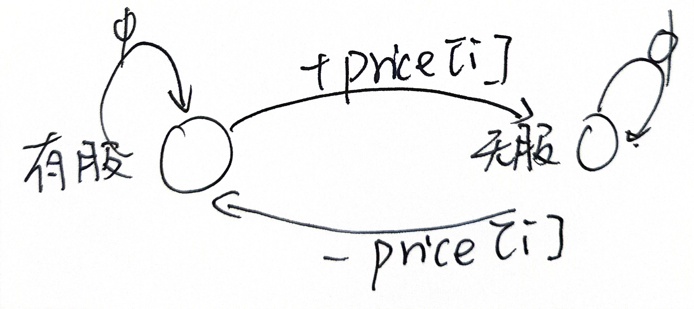

# 动态规划


## 背包问题（0-1背包）

❌❌❌❌

- 假设i代表第i个物品：weights[i],values[i]，然后就是重量为w，表示j
- dp\[i]\[j]表示可以拿前i个物品的情况下，背包容量为j时的最大价值
- 
- 对于一个新物品，新容量
  - 当这个不是第一个数的时候：
  - 如果新的容量**大于**现在对应点的重量
    - 如果装，则价值为`DP[i-1][j-weight]+value[i-1]`
    - 如果不装，则价值为`DP[i][j-1]`
    - 比较两者的大小
  - 如果新的容量小于对应点的重量
    - 那么对应值的`DP[i][j-1]`

## 打家劫舍

- `dp[0]=0;dp[1]=value[0]`
- 循环遍历
  - 如果偷：dp[i] = dp[i-2]+value[i-1]
  - 如果不偷: dp[i]= dp[i-1]

---

空间优化，我们发现，这个只依赖dp[i-1]和dp[i-2],所以我们可以只保存这两个数

- pre2 = 0;pre1 = num[0];
- 其他不变

## 最长子序列匹配问题

- 如果这个点不相同，那么这个点不能匹配→max( dp\[i-1][j],dp\[i][j-1])
- 如果这个点相同，则要考虑有这点之后，两个都会被使用，则:max(dp\[i-1][j-1]+1,max( dp\[i-1][j],dp\[i][j-1]))
- 回溯：随便往哪个方向走（上或者下，但是自己需要规定一个方向，假设先上），如果相同，则说明这个点不是更新点，可以走，如果左、上都不能走，那么只能45跳，跳上去之后两个都自减
  - 每次跳之前需要保存字符，最后使用reverse翻转字符串
  - 直到为i或者j为0的时候停止。

---

优化角度，只需要保存四个数，刚好一个正方形

## LIS（最长递增子序列实现方法）

> 给你一个整数数组 nums ，找到其中最长严格递增子序列的长度。

- 给定一个指定的数组：[1,12,25,12,32,43]，需要求出其中最长的子序列
- 定义一个dp数组，大小和原来的额数组大小一样，dp[N]，表示以这个点**结尾**可以代表的最大子序列
- 要想知道到这个点i最大的子序列，必须要知道前面比他小的数的子序列长度，设置maxtmp=0
  - 遍历小于i的所有点j，如果这个点对应的数小于j，则看看这个点对应的dp[j]+1是不是大于maxtmp=0
  - 遍历完成j之后，将dp[i]←maxtmp
- 返回最后一个数

```cpp
int LIS(vector<int>& nums)
{
    int tmp;
    int maxtmp;
    std::vector<int>dp(nums.size(),1)
    for(int i=0;i<nums.size();i++)
    {
        tmp=1;
        for(int j =0;j<i;j++)
        {
            if(nums[i]>nums[j] && dp[j]+1>tmp)
            {
                tmp = dp[j]+1
            }
        }
        dp[i] = tmp;
        if(tmp> maxtmp)
        {
            maxtmp = tmp;
        }
    }
    return maxtmp;
}
```

## 股票的最佳交易时间

 \1. 买卖股票的最佳时机 I (只能买卖一次) - LeetCode 121：给出的所有时间内只进行一次的买卖

对于股票而言，设置一个dp数组，dp[i]表示第i的最大收益（余额）对于第i天的决策

- 需要保证低买入，高卖出
- 需要保证买入在卖出之前
- 初始本金设置为0

- 遍历所有数组，记录当前状态下卖出会赚多少钱，保存一路走来利润最大值，保存一路走来成本最小值
  - 如果可以卖出？卖出之后的利润大于之前的**最大利润**吗
  - 这个点的成本和最小成本比较，如果这个点成本比最小成本还小，则用这个替代最小成本（因为这个点的成本只能影响后面的利润，**可以替代**）。

---

可以多次买入的情况

画一个状态转移方程



所以对于该节点的卖出和买入两种状态，设置两个状态，看看他们是如何转移的


